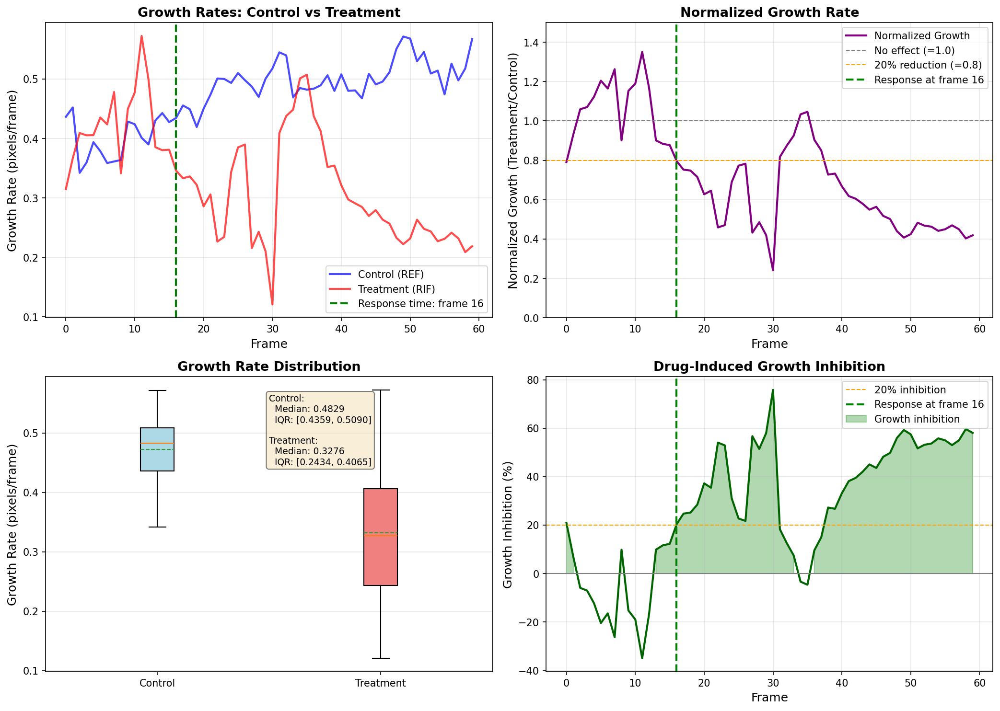

# Cell Tracking and Growth Rate Analysis

This project provides a pipeline for **single-cell tracking** and **growth rate analysis** from time-lapse microscopy data. It compares cell growth between control (REF) and treatment (RIF) conditions.

## Features

- **Hungarian matching-based cell tracking**: Frame-wise global assignment using IoU overlap and centroid distance
- **Growth rate computation**: Local slope estimation from cell elongation (major axis length)
- **Statistical comparison**: Control vs Treatment with t-test, Mann-Whitney U, and effect size (Cohen's d)
- **Visualization**: Tracking overlays, growth curves, boxplots, and timeline plots

---

## Results Preview

### Growth Rate Analysis



**Figure description:**
- **Top-left**: Growth rate over time for Control (blue) and Treatment (red), with shaded 25-75% quantile bands
- **Top-right**: Normalized treatment response (Treatment / Control ratio), dashed line indicates detected drug response time
- **Bottom-left**: Boxplot comparison of overall growth rates between groups
- **Bottom-right**: Track statistics showing number of tracks and average duration per condition

---

## Requirements

### Python Environment

Python 3.8+ with the following packages:

```bash
pip install numpy scipy scikit-image matplotlib tifffile
```

Or create a conda environment:

```bash
conda create -n cell_tracking python=3.10
conda activate cell_tracking
pip install numpy scipy scikit-image matplotlib tifffile
```

---

## Data Structure

The project expects the following directory structure. **This is critical for reproducibility.**

```
project_root/
│
├── data/
│   ├── REF/                          # Control group
│   │   ├── 1/
│   │   │   └── HR_REF_masks/
│   │   │       ├── Pos101/
│   │   │       │   └── PreprocessedPhaseMasks/
│   │   │       │       ├── MASK_img_000000000.tif
│   │   │       │       ├── MASK_img_000000001.tif
│   │   │       │       ├── ...
│   │   │       │       └── MASK_img_000000120.tif
│   │   │       ├── Pos102/
│   │   │       │   └── PreprocessedPhaseMasks/
│   │   │       │       └── MASK_img_*.tif
│   │   │       ├── Pos103/
│   │   │       ├── ...
│   │   │       └── Pos110/
│   │   │
│   │   └── 2/
│   │       └── REF_masks101_110/
│   │           ├── Pos101/
│   │           │   └── MASK_img_*.tif    # Masks directly in position folder
│   │           ├── ...
│   │           └── Pos110/
│   │
│   └── RIF/                          # Treatment group
│       ├── 1/
│       │   └── HR_RIF10_masks/
│       │       ├── Pos201/
│       │       │   └── PreprocessedPhaseMasks/
│       │       │       └── MASK_img_*.tif
│       │       ├── Pos202/
│       │       ├── ...
│       │       └── Pos210/
│       │
│       ├── 2/
│       │   └── RIF10_masks201_210/
│       │       ├── Pos201/
│       │       ├── ...
│       │       └── Pos220/
│       │
│       └── 3/
│           └── RIF10_masks211_217_for_testing/
│               ├── Pos211/
│               ├── ...
│               └── Pos217/
│
├── tracking.py                    # Core tracking algorithm
├── growth_analysis.py             # Growth rate computation
├── run_tracking.py                # Run tracking on all positions
├── run_complete_analysis.py       # Complete pipeline with visualization
├── growth_rate_statistics.py      # Statistical summary and LaTeX table
├── visualize_tracks.py            # Tracking visualization tool
└── README.md
```

### Mask File Format

- **File naming**: `MASK_img_XXXXXXXXX.tif` (9-digit zero-padded frame number)
- **Image format**: 16-bit or 8-bit TIFF, instance segmentation mask
  - `0` = background
  - `1, 2, 3, ...` = individual cell instances
- **Frame count**: Typically 121 frames (0-120)

---

## How to Run (Step by Step)

### Step 1: Run Cell Tracking

Track cells across all positions in both REF and RIF groups:

```bash
python run_tracking.py
```

**Output files:**
- `tracking_results_REF.pickle` - Tracking results for control group
- `tracking_results_RIF.pickle` - Tracking results for treatment group

**What it does:**
- Loads mask images from each position
- Runs Hungarian matching-based tracking
- Saves track data (frames, cell properties) for each position

---

### Step 2: Run Complete Analysis

Compute growth rates and generate visualization figures:

```bash
python run_complete_analysis.py
```

**Output files:**
- `growth_analysis_results.pickle` - Computed growth rates and statistics
- `growth_analysis_results.png` - Combined 2x2 figure
- `fig1_growth_rate_over_time.png` - Growth rate time series
- `fig2_normalized_response.png` - Normalized treatment response
- `fig3_boxplot_comparison.png` - Statistical comparison boxplot
- `fig4_track_statistics.png` - Track count and duration statistics

---

### Step 3: Generate Statistical Summary (Optional)

Generate detailed statistics and LaTeX-formatted table:

```bash
python growth_rate_statistics.py
```

**Console output:**
- Mean, median, standard deviation, quartiles for each group
- t-test and Mann-Whitney U test results
- Cohen's d effect size
- LaTeX table for publication

---

### Step 4: Visualize Tracking Results (Optional)

Visualize tracking on specific positions:

```bash
python visualize_tracks.py
```

**Output directory:** `track_visualization/`
- Frame-by-frame tracking overlays
- Track summary figures

---

## Tracking Parameters

Key parameters in `run_tracking.py`:

| Parameter | Default | Description |
|-----------|---------|-------------|
| `T_early` | 60 | Early phase duration (frames) |
| `max_dist` | 25.0 | Maximum centroid distance (pixels) |
| `min_iou` | 0.2 | Minimum IoU overlap threshold |
| `w_iou` | 1.0 | IoU weight in cost matrix |
| `w_dist` | 0.3 | Distance weight in cost matrix |
| `w_shape` | 0.1 | Shape similarity weight |
| `allow_gap` | False | Allow 1-frame gap closing |

---

## Output Data Format

### Tracking Results (`tracking_results_*.pickle`)

```python
{
    "Pos101": {
        "tracks": [
            {
                "frames": [0, 1, 2, ...],     # Frame indices
                "cells": [
                    {
                        "label": 1,
                        "centroid": (row, col),
                        "area": 1234,
                        "major_axis_length": 56.7,
                        "minor_axis_length": 23.4,
                        "bbox": (r0, c0, r1, c1)
                    },
                    ...
                ]
            },
            ...  # More tracks
        ],
        "diagnostics": {...}  # Tracking statistics
    },
    "Pos102": {...},
    ...
}
```

### Growth Analysis Results (`growth_analysis_results.pickle`)

```python
{
    "control": {
        "times": np.ndarray,           # Time points
        "growth_rates": np.ndarray,    # Median growth rate per time
        "growth_lower": np.ndarray,    # 25th percentile
        "growth_upper": np.ndarray,    # 75th percentile
        "n_tracks": int                # Number of tracks
    },
    "treatment": {...},                # Same structure
    "normalized_ratio": np.ndarray,    # Treatment / Control ratio
    "response_start_frame": int        # Detected drug response time
}
```

---

## Algorithm Overview

### Cell Tracking (Hungarian Matching)

1. **Extract instances** from each frame's mask image
2. **Build cost matrix** between frames t and t+1:
   - Cost = `w_iou * (1 - IoU) + w_dist * normalized_distance + w_shape * shape_diff`
3. **Apply thresholds** to filter impossible matches
4. **Solve assignment** using Hungarian algorithm (`scipy.optimize.linear_sum_assignment`)
5. **Build tracks** by chaining matched cells across frames

### Growth Rate Computation

1. **Extract major axis length** from each tracked cell
2. **Compute local growth rate** using sliding window linear regression
3. **Aggregate across tracks** using median (robust to outliers)
4. **Normalize** treatment by control to show relative response

---

## Citation

If you use this code, please cite the relevant publications for:
- Cellpose (for cell segmentation)
- Your own work using this analysis pipeline

---

## License

MIT License - Feel free to use and modify for your research.
